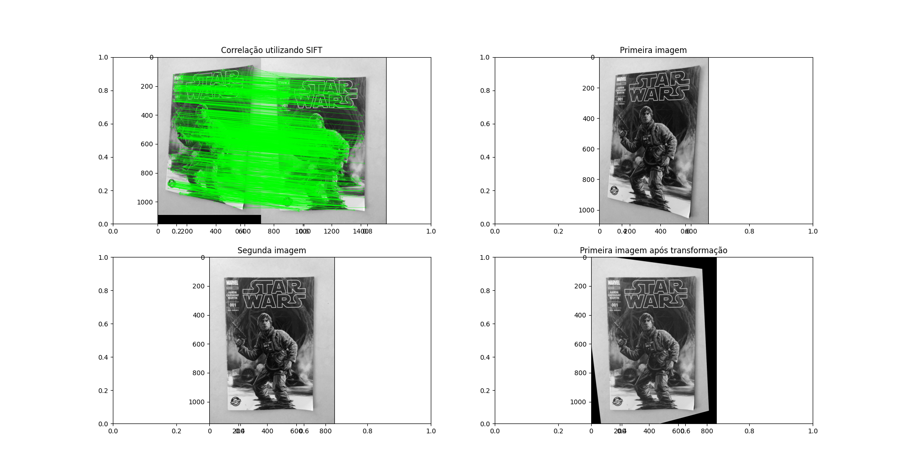
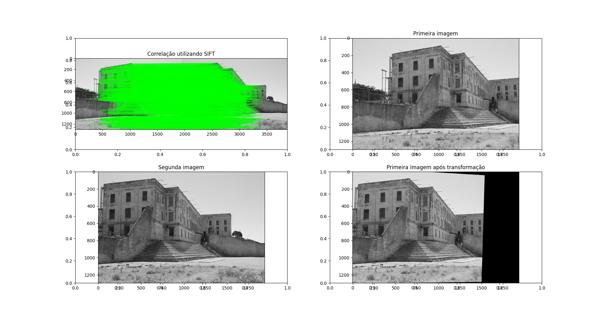

# homography_with_ransac

# Visão Computacional - Homografia com uso de RANSAC para remoção de outliers

O projeto tem como objetivo estimar a homografia entre pares de imagens utilizando técnicas de extração de características (SIFT), correspondência com FLANN e a robustez do algoritmo RANSAC.

---

## Estrutura do Código

O código está organizado em funções:

- ### Normalização de Pontos
  - **`normalize_points(points)`**  
    Normaliza os pontos de uma imagem para melhorar a estabilidade numérica no cálculo da homografia.  
    - Calcula o centróide dos pontos.  
    - Ajusta a escala para que a distância média ao centróide seja √2.  
    - Retorna a matriz de normalização `T` e os pontos normalizados.

- ### Construção da Matriz A (DLT)
  - **`compute_A(pts1, pts2)`**  
    Constrói a matriz `A` para o sistema de equações do método DLT (Direct Linear Transform) a partir dos pontos correspondentes.  
    - Utiliza o produto de Kronecker para empilhar as equações que relacionam os pontos das duas imagens.

- ### Estimativa da Homografia (DLT Normalizado)
  - **`compute_normalized_dlt(pts1, pts2)`**  
    Estima a homografia utilizando a abordagem DLT com normalização.  
    - Adiciona coordenadas homogêneas aos pontos.  
    - Monta a matriz `A` e realiza a decomposição SVD para extrair a solução correspondente à menor singularidade.

  - **`my_homography(pts1, pts2)`**  
    Executa o processo completo de normalização, aplicação do DLT normalizado e denormalização da matriz de homografia.

- ### Estimativa Robusta com RANSAC
  - **`RANSAC(pts1, pts2, dis_threshold, N, Ninl)`**  
    Implementa o algoritmo RANSAC para estimar uma homografia robusta em presença de outliers.
    - **Iteração e Seleção Aleatória:**  
      Em cada iteração, 4 pontos são selecionados aleatoriamente para calcular uma homografia candidate utilizando `my_homography`.
    - **Avaliação de Inliers:**  
      Os pontos são projetados usando a homografia candidate e a distância entre os pontos projetados e os pontos reais é calculada.  
      Um ponto é considerado *inlier* se a distância for menor que o limiar `dis_threshold`:
      ```math
      \text{Erro} = \|H \cdot x - x'\|
      ```
    - **Seleção do Melhor Modelo:**  
      A homografia com o maior número de inliers é escolhida. Se o número de inliers atinge ou supera `Ninl`, o algoritmo pode interromper as iterações.
    - **Refinamento:**  
      A homografia final é reestimada utilizando todos os inliers identificados.

- ### Detecção e Correspondência de Pontos (SIFT e FLANN)
  - SIFT é utilizado para detectar e descrever os pontos chave em cada imagem.  
  - FLANN é empregado para encontrar as melhores correspondências entre os descritores das imagens.
  - Após a correspondência, o RANSAC é aplicado para estimar uma homografia robusta e remover correlações falhas entre SIFT E FLANN.

- ### Visualização
  - Alguns exemplos em imagens internas são exibidos abaixo.






---

## Exemplo de Uso

Para executar o código e visualizar os resultados, basta rodar:

```bash
python Trab2_Antonio_Entringer.py
